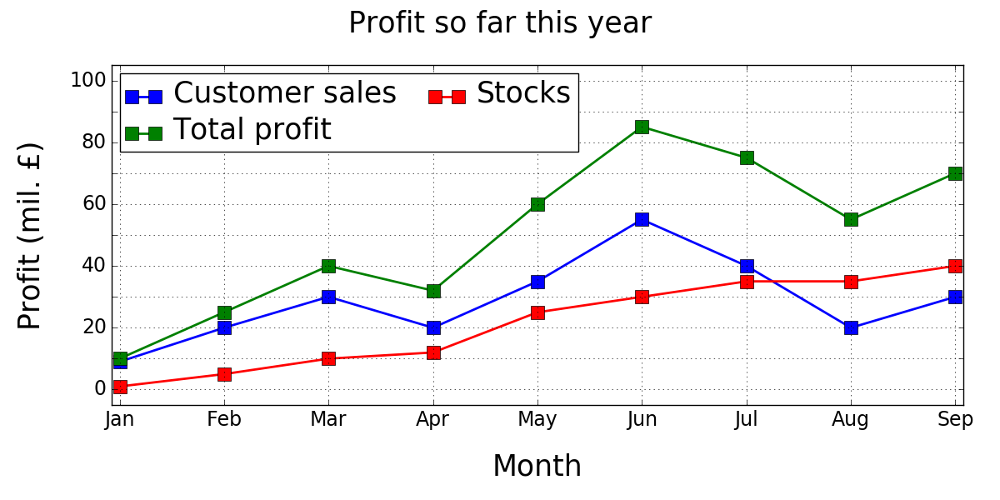
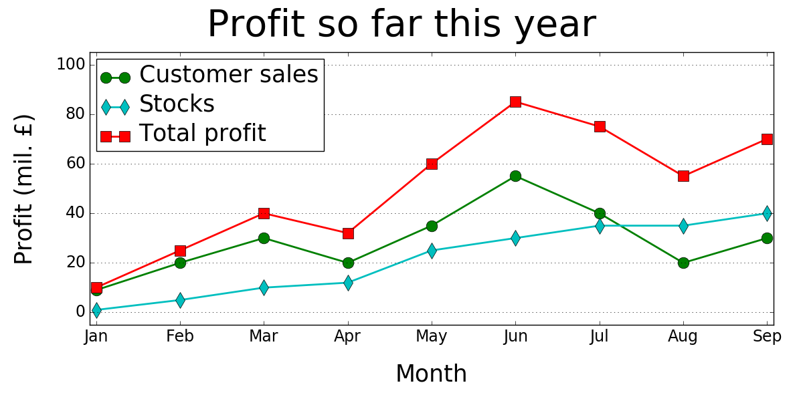

===================================================
Advanced: Using styles
===================================================

Styles a way of specifying how plots created by :mod:`pyCreeper.crGraphs` should look like. Styles are encapsulated in a :mod:`pyCreeper.crGraphStyle.crGraphStyle` object and the object's properties may be set to change different settings.

**There are several advantages of using pyCreeper's crGraphStyle compared to the standard matplotlib way**:

1. **crGraphStyle disallows setting of properties that are invalid.** This means that python will let you know when you try to set a style that does not exist.
2. When you set crGraphStyle properties, **a type check is performed** in the background. Python will let you know if you are trying to set a property value that does not make sense
3. **Enumerations instead of strings are used where appropriate**, for example, to set a grid style. This meas that you can easily select from a set of valid values.
4. You can **easily revert to the default look** by calling the reset function

When no styles are specified, :mod:`pyCreeper.crGraphs` uses a default style. For example, a default line plot may look like this:

**To change the way the plot looks,** for example, to change the colours, markers, font sizes, etc., properties of a :mod:`pyCreeper.crGraphStyle.crGraphStyle` need to be set. There are two ways of doing this.

One way is to create a brand new :mod:`pyCreeper.crGraphStyle.crGraphStyle` object, set its properties and then assign it to :mod:`pyCreeper.crGraphs`:

.. code-block:: python

    from python.pyCreeper import crGraphStyle;

    #-- create new style object
    myStyle = crGraphStyle.crGraphStyle();
    style.markers = ['o','o','s'];
    style.colors = ['g','c','r'];
    style.titleFontSize = 40;
    style.numOfLegendColumns = 1;
    style.gridType = crGraphStyle.GRID_TYPE.MAJOR_HORIZONTAL;

    #-- assign it to crGraphs
    crGraphs.setStyle(style);

Another way is to directly set properties of the :mod:`pyCreeper.crGraphStyle.crGraphStyle` instance that is already stored in :mod:`pyCreeper.crGraphs`:

.. code-block:: python

    crGraphs.getStyle().markers = ['o','o','s'];
    crGraphs.getStyle().colors = ['g','c','r'];
    crGraphs.getStyle().titleFontSize = 40;
    crGraphs.getStyle().numOfLegendColumns = 1;
    crGraphs.getStyle().crGraphStyle.GRID_TYPE.MAJOR_HORIZONTAL;

Whichever way you use, :mod:`pyCreeper.crGraphs` now contains the new style:

Have a look at the :mod:`pyCreeper.crGraphStyle.crGraphStyle` documentation to see what style properties you can set.

**The style will be applied to all** :mod:`pyCreeper.crGraphs` **function calls in the same python document. To reset the styles back to defaults, use**

.. code-block:: python

    myStyle = crGraphStyle.crGraphStyle();
    crGraphs.setStyle(style);

or simply

.. code-block:: python

    crGraphs.getStyle().reset();

