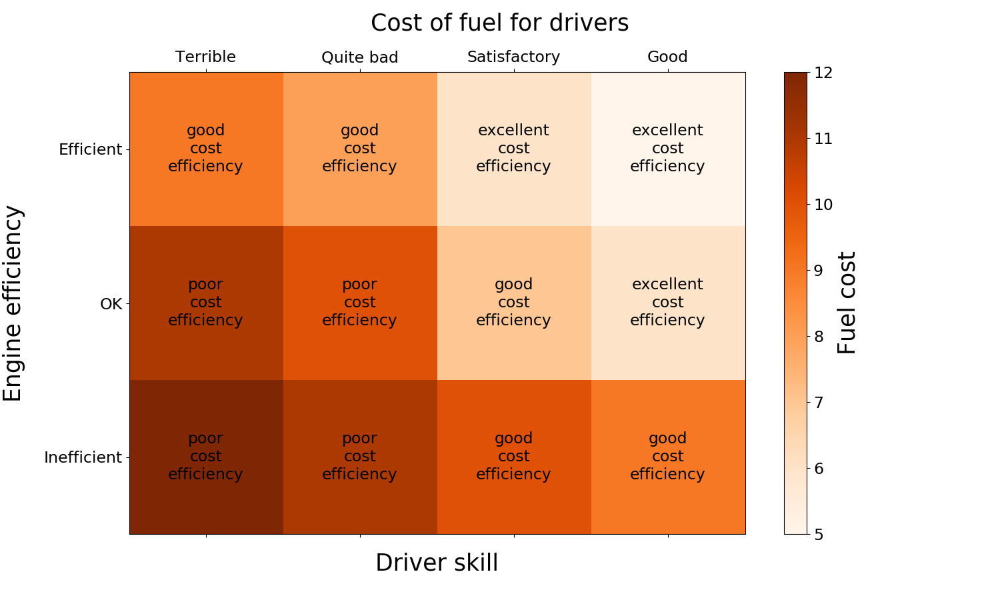
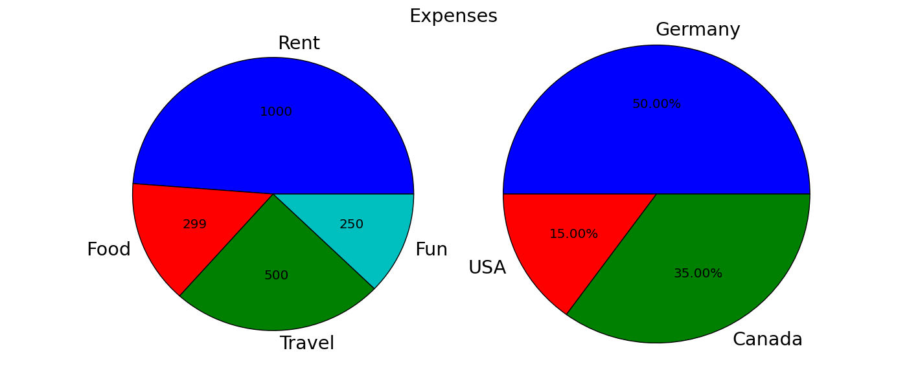

===================================================
Supported figure types
===================================================

----------------------------
Matrix plots
----------------------------

    Function :func:`pyCreeper.crGraphs.createMatrixPlot`

    Code examples:
    :func:`examples.matrixPlots.example1_simple`
    :func:`examples.matrixPlots.example2_customAnnotations`

----------------------------
Pie charts
----------------------------

    Function :func:`pyCreeper.crGraphs.createPieChart`

    Code examples:
    :func:`examples.pieCharts.example1_simple`
    :func:`examples.pieCharts.example2_colors`
    :func:`examples.pieCharts.example3_multiFigure`