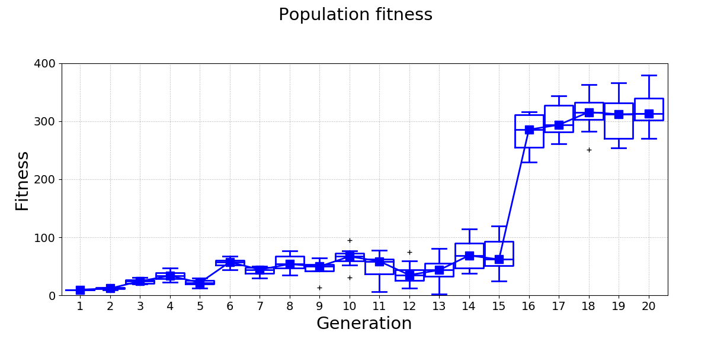
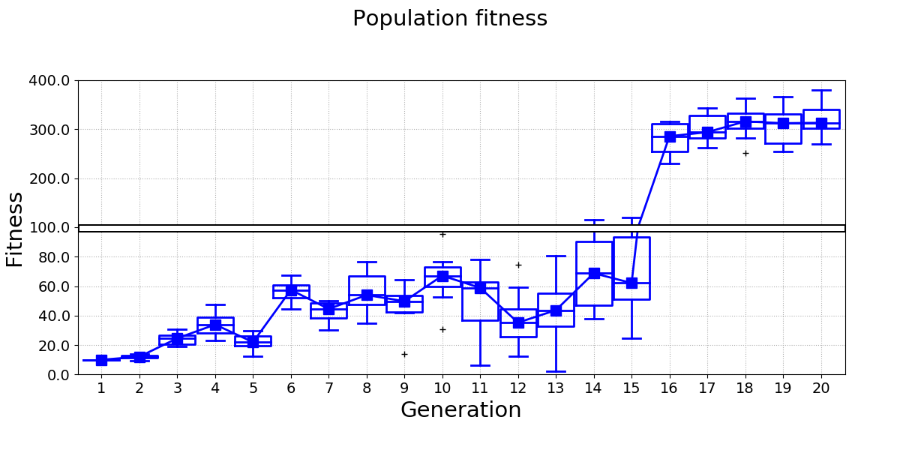
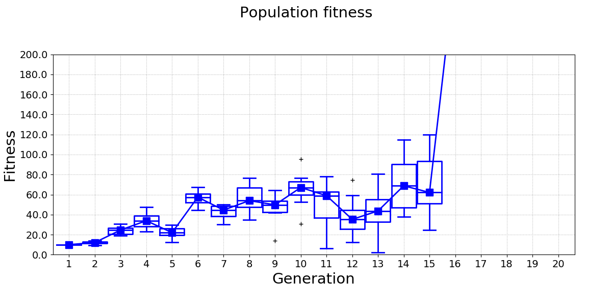
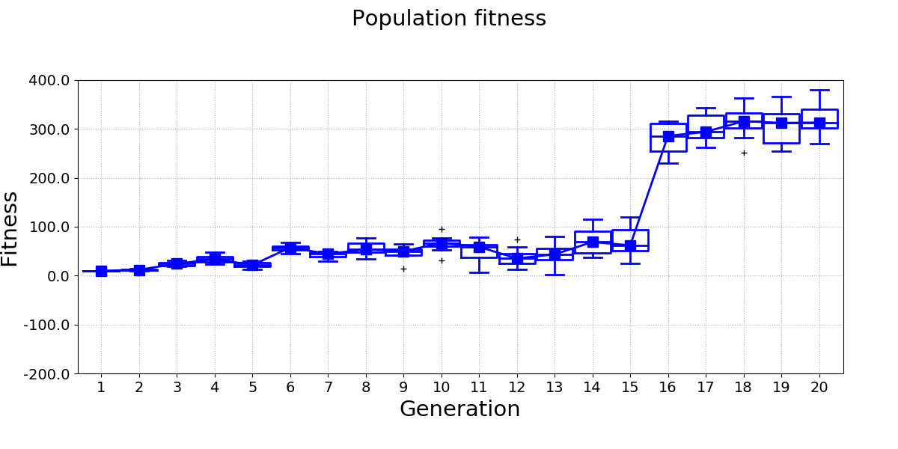

===================================================
Tutorial: Broken line plots
===================================================

Broken line plots are very useful when it comes to displaying data sets where some part of data spans a range that is very different from the rest of the data set. For example, consider the following figure:

Differences between the fitness of generations 1-15 are difficult to see, because the range of the y-axis has to be set so that it also covers the fitness of generations 16-20.
A broken line plot equivalent for this data looks much better:

pyCreeper provides functionality that helps you create broken line plots with ease.
The plot essentially consists of two figures, bottom and top, that have the same dimensions and layout but display different data ranges.
These two figures can be combined in your favourite image editor in order to create the final plot.

The first step is to identify the minimum and maximum y values of your plot and the point at which the broken line will be drawn:

.. code-block:: python

    yMinStandardPlot = 0; # y min of a plot that would normally be drawn for all data
    yMaxStandardPlot = 400; # y max of a plot that would normally be drawn for all data
    brokenLineYCoordinate = 100; # y value at which broken line will be drawn. This value separates the two "zoomedIn" and "zoomedOut" plots
    brokenLineHeightPercentage = 50; # percentage of the plot height at which the broken line will be drawn

You can then obtain y-axis parameters of the two figures by using :func:`pyCreeper.crGraphs.getBrokenLinePlotParameters`

.. code-block:: python

    yMinBottomPlot, yMaxBottomPlot, yMinTopPlot, yMaxTopPlot = crGraphs.getBrokenLinePlotParameters(yMinStandardPlot, brokenLineYCoordinate, yMaxStandardPlot, brokenLineHeightPercentage);

And finally generate the two figures:

.. code-block:: python

    crGraphs.createLinePlot(data, "Population fitness", xTickLabels_=xTickLabels, xLabel_="Generation", yLabel_="Fitness", yMin_=yMinBottomPlot, yMax_=yMaxBottomPlot,
                            yTicksStep_=20, showBoxPlots_=True, lineWidth_=2, filePath_=filePathBottomPlot);
    crGraphs.createLinePlot(data, "Population fitness", xTickLabels_=xTickLabels, xLabel_="Generation", yLabel_="Fitness", yMin_=yMinTopPlot, yMax_=yMaxTopPlot,
                            showBoxPlots_=True, lineWidth_=2, filePath_=filePathTopPlot);

The generated figures look like this:

The following video shows an example of how the figures can be combined into the final broken line plot:

.. raw:: html

    <iframe width="100%" height="400" src="https://www.youtube.com/embed/ZV8fXOXvjJA" frameborder="0" allowfullscreen></iframe>
      

The full code example is available here:

.. automodule:: examples.brokenLinePlots
    :members:
    :undoc-members:
